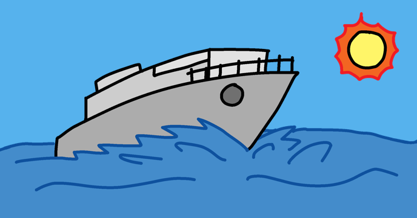

# Boat race

Build a boat-racing game in Scratch using the Raspberry Pi Code Editor. Steer around barriers, cross booster arrows and dodge a spinning gate to reach the island.

Find the project online at [Boat race](https://projects.raspberrypi.org/en/projects/editor-boat-race/landing).

## Resources

- [Starter project](en/resources/BoatRaceResources.sb3)
- [Completed project](en/solutions/BoatRace-Finished.sb3)
- [English project structure](en/README.md)

## Contributing

See [CONTRIBUTING.md](CONTRIBUTING.md)

## Licence

See [LICENCE.md](LICENCE.md)

## Setting up a Crowdin project

See [CROWDIN.md](CROWDIN.md).
