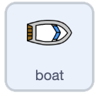

## Starting the boat

The starter project is open beside these instructions, with the boat sprite and a race course to steer around.

Make the boat start in the corner and follow the mouse pointer.


## Step 1



Click on the **Boat sprite**, then add these blocks to make a starting position.

```blocks3
when flag clicked
point in direction (0)
go to x: (-190) y: (-150)
```

## Step 2

Add `forever`{:class="block3control"} and `point towards`{:class="block3motion"} blocks to `move`{:class="block3motion"} while following the cursor.

```blocks3
when flag clicked
point in direction (0)
go to x: (-190) y: (-150)
+forever
point towards (mouse-pointer v)
move (1) steps
+end
```

## Now run your code

Click the green flag and move your mouse.

Check that the boat follows the pointer around the screen.


