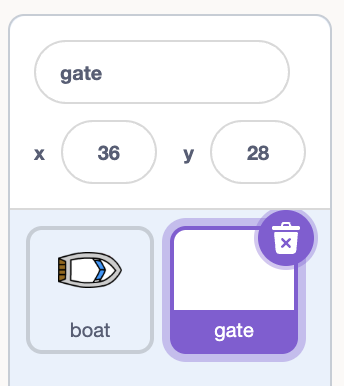
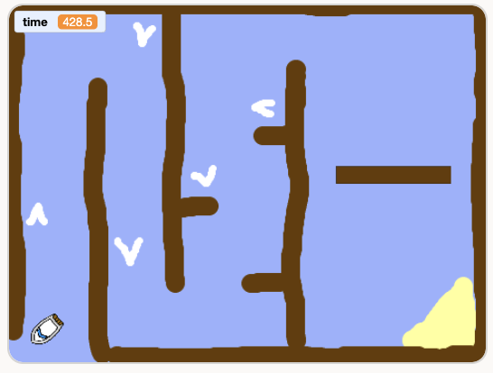

## Make a spinning gate

Add an obstacle for the boat to avoid.

## Step 1

Paint a new sprite and name it **gate**.

## Step 2

Match the fill colour to the wooden barriers.

> ## Tip
>
> If the colour is hard to match, set it to colour 9, saturation 100, brightness 40.

## Step 3

Draw a gate with the Rectangle tool. Centre the gate in the middle of the costume canvas, so it spins on the spot.

## Step 4

On the stage, drag the gate into the boat's path, between the start and the island.

Resize it if it is too big.

