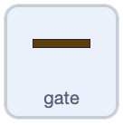

## Spin the gate

Make the gate spin round so it is harder to steer past.

In the **Code tab**, add a `forever`{:class="block3control"} loop with a `turn 1 degree`{:class="block3motion"}.



```blocks3
when flag clicked
forever
turn cw (1) degrees
end
```

## Now run your code

Click the green flag.

Check that the gate spins and that hitting it makes the boat crash.


