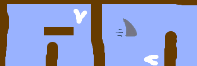

## Challenge

Here are some ideas to make the game your own.

Pick one idea, make the change, then test it.

### Add sound effects

You can add `sounds`{:class="block3sound"} that play when the boat crashes or reaches the island.

You could also add background music to the Stage.

### Add more obstacles

For example, add green slime to your backdrop and change the code so touching it slows the boat down.

You could add a moving obstacle, like a log or a shark!

### Turn your game into a race between two players

The second player could control their boat with the up arrow key to move forward and the left and right arrow keys to turn.

### Create more levels by adding different backdrops

Can you then let the player choose between levels?
