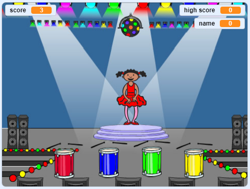

## What can you do now?

Try our [More Scratch 2](https://projects.raspberrypi.org/en/pathways/scratch-module-2) project pathway, where you can make a memory game.

Click on the green flag to start.

Watch the sequence of colours shown by the dancer's dress and listen to the drum beats, then repeat the colours back to her.

If you get the order wrong, it's game over!

<iframe allowtransparency="true" width="485" height="402" src="//scratch.mit.edu/projects/embed/284452634/?autostart=false" frameborder="0" allowfullscreen scrolling="no"></iframe>

Or, why not try out another [Scratch](https://projects.raspberrypi.org/en/projects?software%5B%5D=scratch) project?
