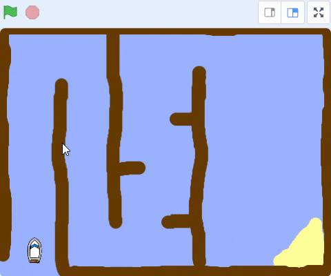

## Controlling the boat

Make the boat start in the corner and follow the mouse pointer.

Click on the `Boat`{:class="block3looks"} sprite, then add this code so it starts in the bottom left-hand corner pointing up and then follows the mouse pointer.

```blocks3
when flag clicked
point in direction (0)
go to x: (-190) y: (-150)
forever
point towards (mouse-pointer v)
move (1) steps
```

## Now run your code

Click the green flag and move the mouse.

The boat sprite moves towards the mouse pointer.

--- no-print ---



--- /no-print ---

--- print-only ---


--- /print-only ---
