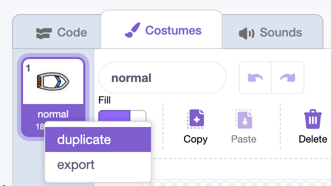
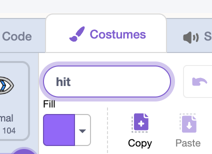

## Crash costumes

Give the boat a second costume that looks wrecked.

## Step 1

In the **Costumes tab**, duplicate the costume.

## Step 2

Name one costume **normal** and the other **hit**.

## Step 3

Click on your **hit** costume.

Use the paint editor tools to move and rotate parts of the boat to make it look smashed up.

