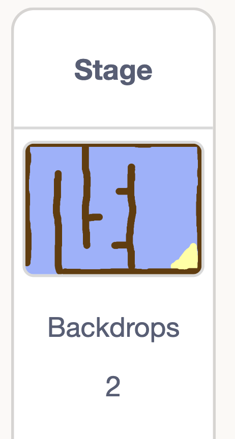
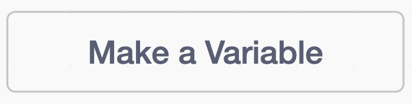

## Add a timer

Add a timer so the player has to reach the island quickly.

## Step 1

Click on the **Stage**.

{:width="150px"}

## Step 2

In the `variables`{:class="block3variables"} menu, make a new variable and name it **time**.



An orange box will appear on the stage.


## Step 3

Add a `green flag`{:class="block3events"} and `set`{:class="block3variables"} the time to `0`.

```blocks3
+when flag clicked
+set [time v] to [0]
```
## Step 4

Add a loop that changes the time every `0.1` seconds.

```blocks3
when flag clicked
set [time v] to [0]
+forever
wait (0.1) seconds
change [time v] by (0.1)
end
```

## Now run your code

Click the green flag and check that the timer counts up as you play.


