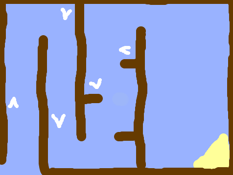

## Booster arrows

Add some boosters to speed the boat up.

Paint some white booster arrows onto your backdrop by painting the backdrop on the Stage.

## Tip

You can make your backdrop look like this by clicking the purple `next backdrop`{:class="block3looks"} block in the looks menu.

The arrows won't do anything yet.

You'll add the code that makes them speed up the boat in the next step.
